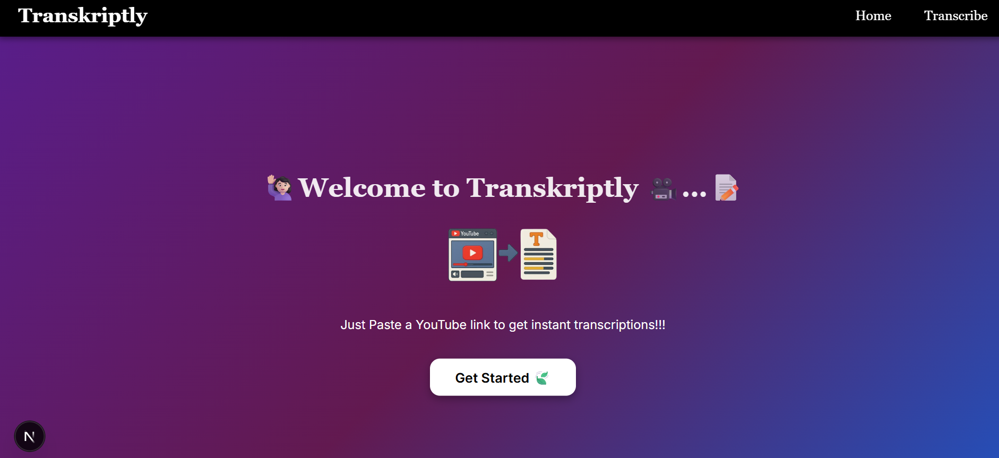
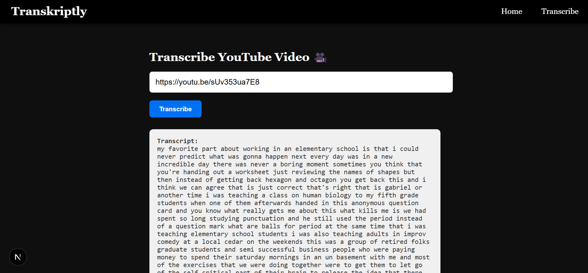
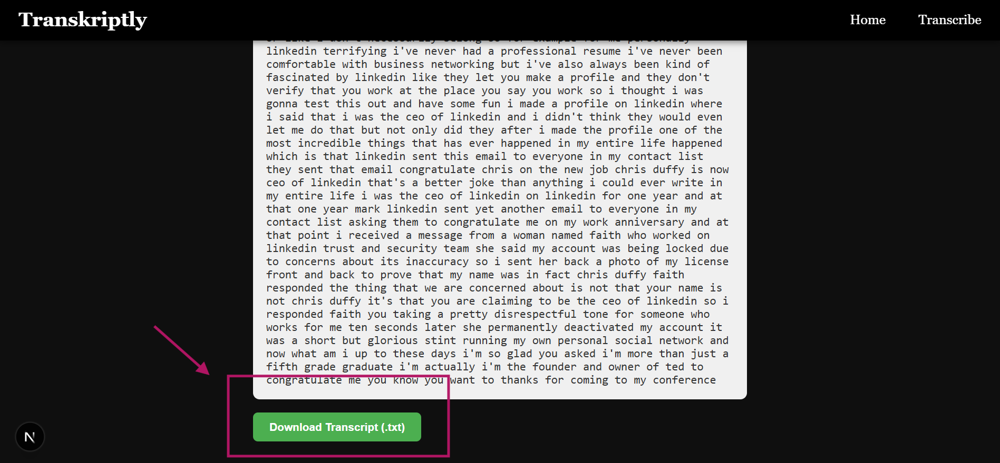

# Transkriptly 🎙️

**Transkriptly** is a simple, modern web app that lets users transcribe YouTube videos using Deepgram's powerful AI transcription API.

---

## 🚀 Features

- ✅ Upload or paste a YouTube video link
- ✅ Get fast, accurate transcriptions
- ✅ View transcript with proper formatting
- ✅ Download transcript as `.txt` file
- ✅ Clean, minimal interface (built with React + Next.js)

---

## 🖼️ Preview

  
  
  
---

## 🛠️ Tech Stack

- [Next.js 15](https://nextjs.org/)
- [React 19](https://reactjs.org/)
- [Deepgram API](https://developers.deepgram.com/)
- Deployed on [Vercel](https://vercel.com/)

---

## ⚙️ Setup Instructions

### 1. Clone the repo
```bash
git clone https://github.com/your-username/transkriptly.git
cd transkriptly
npm run dev 
